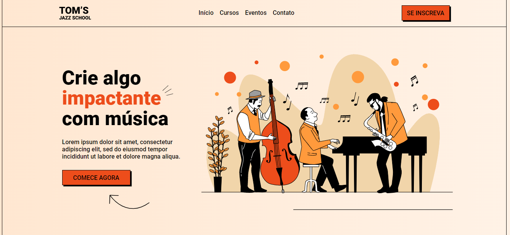

# Toms-Jazz-School
Esta é uma Landing Page criada com base nas aulas da OneBitCode. A Landing Page é para a "Tom's Jazz School", uma escola de música fictícia.

## Descrição

Este projeto é uma página web que destaca os cursos oferecidos pela Tom's Jazz School. Ela inclui informações sobre os cursos, seções de destaques e um formulário de inscrição para receber materiais gratuitos.

## Conteúdo do Repositório

- `index.html`: O arquivo HTML que define a estrutura da página.
- `index.css`: O arquivo CSS com os estilos da página.
- Pasta `img`: Contém imagens utilizadas na página.

## Como Usar

1. Clone este repositório para o seu computador.
2. Abra o arquivo `index.html` em um navegador web para visualizar a Landing Page.
3. Explore as seções da página.

## Acesso as aulas

Tenha Acesso as aulas desse projeto e seus materiais de apoio através deste [link](https://www.onebitcode.com/projetoaulas).
